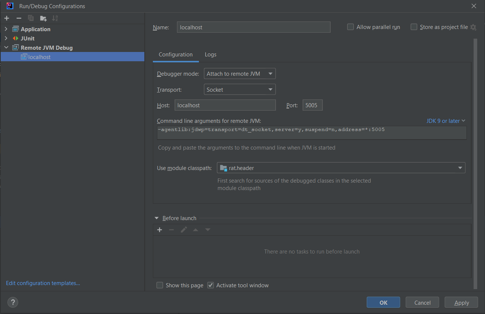

# Spring boot web app in docker
Spring boot web app running in docker example

## Build
````
mvn clean install -Pdocker
````
## Deploy
run container
````
docker-compose up
````
stop container
````
ctrl+C
````
remove container
````
docker-compose down
````
## Run

### Web api example:

````
curl http://localhost:8080/rat
````
Check logs in the console

### Filter chain example:

- Go in browser to 
````
http://localhost:8080/login?state=333
````
- Enter any 'username' and 'password'
- Click 'login'
- Check logs in the console

## debug
Just add Run/Debug config 


then run debug